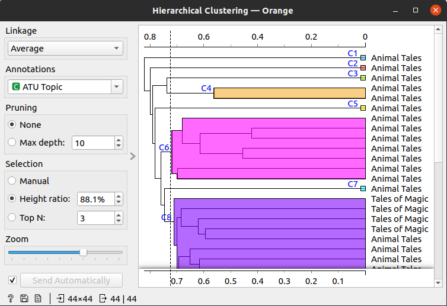

::: {.content-hidden when-format="pdf"}

Brouillon de l'évaluation du logiciel Orange Data Mining.

## Rappel des critères

### Description

- Type de logiciel (libre, propriétaire, etc.)
- Type de licence (fixe, libre, académique, mixte, etc.)
- Coût
- Langage de programmation (Python, Java, etc.)

### Maturité du logiciel

- Âge du logiciel
- Année en affaires de l'entreprise
- Nombre de mois depuis la dernière mise à jour
- Le logiciel est-il encore supporté par le développeur ou le créateur

### Interopérabilité

Critères qui impliquent la capacité du logiciel à s'harmoniser avec le système déjà en place et sa faculté de fonctionner conjointement avec d'autres ressources logicielles et matérielles.

- Compatibilité avec les plateformes et systèmes d'exploitation
- Intégration Web
- Intégration à d'autres applications
- Dépendances logicielles ou matérielles

### Soutien technique

Critères qui mesurent l'aide disponible pour les utilisateurs du logiciel.

- Accès à une version de démonstration
- Assistance technique
- Documentation 
- Tutoriel
- Communauté

:::
## Évaluation du logiciel Orange Data Mining
### Description

- Type de logiciel : *Orange Data Mining* (Orange) est un logiciel libre, développé par le laboratoire de bioinformatique (faculté des sciences de l'information et informatique) de l'Université de Llubljana en Slovénie. Nous levons la confusion possible avec la firme française Orange : Orange Data Mining n'a aucun lien avec cette entreprise de services en télécommunication.
- Type de licence : Le logiciel est sous GNU General Public License 3.0, les documentations et documents additionnels sont tous sous licence Creative Commons Attribution-ShareAlike.
- Coût : Aucun paiement n'est requis pour utiliser le logiciel, toutefois il est possible d'effectuer une donation pour financer le projet.
- Langage de programmation : La base logicielle est développée en C++, et les *widgets*, nous y reviendrons plus tard, sont développés avec le langage de programmation Python.

### Maturité du logiciel

- Âge du logiciel : La version 3 du logiciel remonte à 2013, avec une première _release_ en 2014 (version 3.1). Orange est développé au tout début de l'essor des algorithmes d'intelligence artificielle et dans le même laps de temps que d'autres librairies (python) telle que ScikitLearn.
- Année en affaires de l'entreprise : Le logiciel a été créé et est maintenu par le même laboratoire depuis 2013.
- Le [dépôt Git d'Orange](https://github.com/biolab/orange3) est très dense. Les derniers _commits_ remontent tout juste à quelques heures avant l'écriture de ce billet (21 novembre 2022, 18h00). Ce projet comptabilise à son actif pas moins de 14,442 _commits_, 3800 étoiles, 881 _forks_, plus de 35 _releases_ (la dernière datant du 11 octobre 2022, _release_ 3.33.0) et pas moins de 92 contributeurs. Un autre élément qui démontre l'activité de ce projet est le nombre d'_issues_ (de problèmes ou questions à résoudre) : nous en observons 91 ouvertes et 2017 fermées.

### Interopérabilité

- Compatibilité avec les plateformes et les systèmes d'exploitation : Ce logiciel est compatible avec les systèmes d'exploitation les plus répandus. Nous avons testé de l'installer sous deux OS (Windows 10 et Ubuntu 20.04.5 LTS) et nous n'avons rencontré aucune difficulté. Dans le premier cas, il s'agit de télécharger un fichier exécutable `.exe` et de l'exécuter, le *wizard* d'installation s'occupe alors du reste. Du côté d'Ubuntu, l'installation est encore plus simple : elle est réalisable dans le terminal via l'installateur de paquet Python `pip` ou `Anaconda`, nous avons choisi la première option : tout s'est déroulé sans le moindre bug.

- Intégration à d'autres applications : Orange n'est pas forcément prévu pour s'inscrire dans un écosystème où les logiciels peuvent communiquer entre eux. Les formats de données utilisables en entrée du processus sont assez larges tant qu'ils respectent la forme d'un tableau (`.xlsx`, `.csv`, Google Sheet, table d'une base de données SQL). Par contre, les possibilités d'exports sont plus minces : seules les visualisations générées et les modèles (*workflows*) peuvent être exportés depuis le logiciel. Cependant, le logiciel offre beaucoup de plasticité, notamment au niveau des méthodes mises en œuvre puisqu'il est possible de développer ses propres *widgets* en Python et de les utiliser dans Orange, par exemple pour créer des *workflows* adaptés à des questions de recherche ou des modèles de données peu conventionnels.
- Dépendances logicielles ou matérielles : Il n'y aucune dépendance hormis le langage de programmation Python (qui est nativement installé sur les distributions Mac et Linux).

### Soutien technique

Critères qui mesurent l'aide disponible pour les utilisateurs du logiciel.

- Accès à une version de démonstration : Il n'y a pas réellement de version de démonstration. Plusieurs exemples sont fournis à l'intérieur du logiciel et permettent de tester directement différents *workflows* ou méthodes à appliquer à des corpus de données. D'ailleurs, plusieurs corpus sont également disponibles avec le logiciel. Au-delà de leur emploi et de l'application de calculs sur ces données, il est possible de les ouvrir et regarder la structure des données (fait sans doute important lors d'une phase d'apprentissage des outils d'intelligence artificielle).
- Assistance technique : Il est possible de prendre contact avec la communauté Orange à travers différentes plateformes : le site Web, les réseaux sociaux, ou encore Discord et Stack Exchange.
- Documentation : Orange fournit des documentations très précises quant aux différents usages du logiciel ou des développements possibles (voir les URLs dans la section références en bas du document). Cependant, nous noterons que la documentation ne décrit pas complètement le comportement des algorithmes que les usagers vont employer.
- Tutoriels : Des tutoriels et des exemples sont disponibles un peu partout dans Orange : il est possible de trouver dans le logiciel des *workflows* génériques prêt à l'emploi, avec des explications pour chacune des étapes à réaliser. L'équipe d'Orange a également publié des tutoriels vidéos sur la plateforme Youtube et des documentations plus poussées pour des utilisateurs avancés. En tant que nouveaux utilisateurs, nous nous sentons vraiment accompagnés dans l'apprentissage et la prise en main de l'outil.

### Quelques essais de l'outil

#### Principe de fonctionnement

Orange est basé sur le principe de _visual programming_ (comme pour les logiciels [Pure Data](https://puredata.info/) ou [Max/MSP](https://cycling74.com/products/max)). Une fenêtre s'ouvre et l'utilisateur doit assembler des `widgets` dans le plan de travail pour créer son `workflow` : ce sont les différentes étapes et méthodes appliquées au corpus de données. L'utilisateur relie les *widgets* entre eux pour automatiser la communication des données (*in* et *out*) jusqu'à la dernière étape choisie dans le *workflow*. 

Tout *workflow* est initié par l'importation des données, auxquelles seront appliqués différents traitements en vue d'obtenir les résultats escomptés. Orange est tout autant utilisé pour faire de la fouille de données que de la fouille de textes. D'ailleurs, dans le site Web du logiciel, un système de mot-clefs permet de repérer rapidement les exemples de *workflow* appartenant à telle ou telle catégorie de traitement. 

Ci-dessous un premier test réalisé avec un des jeux de données (test) fourni par le logiciel.

Le jeu de données est un `corpus` de texte au format `.tab`.

Le premier widget que nous appliquerons au corpus sera le `preprocess text`.

Cette phase permet de transformer notre texte (application du `lowercase` pour enlever les majuscules), de le tokeniser grâce à l'expression régulière `\w+` (pour matcher avec tous les caractères sauf les espaces), puis de le filtrer grâce à une liste de `stopwords` en anglais.

Le deuxième widget sera appliqué au corpus preprocessé, il s'agit du widget `bag of words`.

Bag of words permet de générer un compteur pour chaque donnée du document.

Le troisième widget de ce workflow s'appelle `Distances`.

Il permet de calculer la distance entre les documents (cosinus). Plus la distance est petite, plus les documents sont proches et similaires.

Le quatrième widget se nomme `Hierarchical Clustering`.

Cette étape marque le début de la visualisation des résultats après transformation des données : elle permet de visualiser la hiérarchie des documents à travers un dendrogramme.

Le dernier widget, encore une visualisation, est intitulé `MDS`.

Il offre une visualisation spatiale de nos données réalisée grâce à un autre calcul de distance.

### Commentaires

Un autre test a été réalisé avec notre corpus d'épigrammes au format `.csv` (français, anglais, grec ancien) et il n'a pas été aussi simple d'appliquer ce *workflow* à nos données. Les résultats obtenus ne faisaient pas sens : autant la génération d'un nuage de mot (avec le widget `wordcloud`) est très facile, autant les calculs de distance et la création de clusters hiérarchisés ne fonctionnait pas. Le problème est relativement simple à cibler : l'ordinateur utilisé pour le test surchauffe et n'est pas assez puissant pour traiter ce corpus (le logiciel "ne répond plus"). 

Orange est un logiciel confortable à utiliser, la prise en main se fait très rapidement et la documentation (très fournie) accompagne l'utilisateur tout au long de son apprentissage. On trouve des informations sur le site Web du logiciel ainsi qu'une multitude de petits tutoriels sur YouTube pour expliquer chacune des étapes. Cependant, dès les premières manipulations, nous avons ressenti une légère frustration (relative au _visual programming_) car les *widgets*, certes très intuitifs, camouflent le fonctionnement des algorithmes appliqués au corpus. L'agencement des widgets entre eux permet de bien voir le parcours de nos données, mais cela rend les calculs appliqués opaques. N'étant pas expert dans le domaine de la fouille de texte (plutôt néophyte) il est plus difficile de comprendre comment fonctionne exactement chaque *widget*. Par exemple, le *widget* `Distances` ne propose qu'un petit sélecteur pour le type de distance à calculer, mais que se passe-t-il sous ce sélecteur ? Nous obtenons des résultats, mais sans comprendre comment le logiciel les a générés.

## Références

- Demsar J, Curk T, Erjavec A, Gorup C, Hocevar T, Milutinovic M, Mozina M, Polajnar M, Toplak M, Staric A, Stajdohar M, Umek L, Zagar L, Zbontar J, Zitnik M, Zupan B (2013) Orange: Data Mining Toolbox in Python, Journal of Machine Learning Research 14(Aug): 2349−2353.

- Site Web du logiciel : https://orangedatamining.com/
- Documentation Data Mining Library : https://orange3.readthedocs.io/projects/orange-data-mining-library/en/latest/index.html#
- Documentation utilisateurs (visual programming) : https://orange3.readthedocs.io/projects/orange-visual-programming/en/latest/index.html
- Documentation développements : https://orange3.readthedocs.io/projects/orange-development/en/latest/index.html
- GitHub du projet : https://github.com/biolab/orange3

