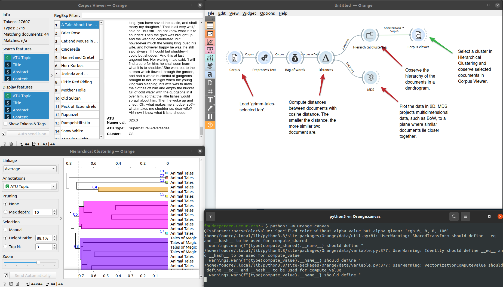
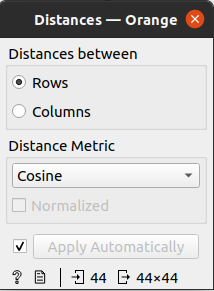

Premiers tests avec l'outil [Orange Data Mining](https://orangedatamining.com/).

## Installation

L'installation du logiciel sur ma machine s'est déroulée sans accroc : la manipulation est très simple, il suffit de lancer la commande `pip install orange3` dans le terminal, puis une fois les paquets installés, il faut utiliser la commande `python -m Orange.canvas` et le tour est joué ! Le logiciel se lance !

## Principe de fonctionnement

Orange est basé sur le principe de _visual programming_ (un peu comme les logiciels [Pure Data](https://puredata.info/) ou [Max/MSP](https://cycling74.com/products/max)). Une fenêtre s'ouvre et l'utilisateur doit assembler des `widgets` dans le plan de travail pour créer son `workflow`.

Tout workflow est initié par l'importation des données, auxquelles seront appliqués différents traitements en vue d'obtenir les résultats escomptés. Orange est tout autant utilisé pour faire de la fouille de données que de la fouille de textes.

Ci-dessous un premier test réalisé avec un des jeux de données (test) fourni par le logiciel.

Le jeu de données est un `corpus` de texte au format `.tab`.

Le premier widget que nous appliquerons au corpus sera le `preprocess text`.

Cette phase permet de transformer notre texte (application du `lowercase` pour enlever les majuscules), de le tokeniser grâce à l'expression régulière `\w+` (pour matcher avec tous les caractères), puis de le filtrer grâce à une liste de `stopwords` en anglais.

Le deuxième widget sera appliqué au corpus preprocessé, il s'agit du widget `bag of words`

Bag of words permet de générer un compteur pour chaque donnée du document.

Le troisième widget de ce workflow s'appelle `Distances`.

Il permet de calculer la distance entre les document (cosinus). Plus la distance est petite, plus les documents sont proches et similaire.

Le quatrième widget se nomme `Hierarchical Clustering`.

Cette étape marque le début de la visualisation des résultats après transformation des données : elle permet de visualiser la hiérarchie des documents à travers un dendrogramme.

Le dernier widget, encore une visualisation, est intitulé `MDS`.

Il offre une visualisation spatiale de nos données.

## Commentaires

Un autre test a été réalisé avec notre corpus d'épigrammes au format `.csv` (français, anglais, grec ancien) et il n'a pas été aussi simple d'appliquer ce workflow à nos données. Les résultats obtenus ne faisaient pas sens : autant la génération d'un nuage de mot (avec le widget `wordcloud`) est très facile, autant les calculs de distance et la création de clusters hiérarchisés ne fonctionnait pas. Le problème est relativement simple à cibler : le corpus n'est pas annoté par des étiquettes, alors que le corpus fourni par Orange l'est. 

Notre prochaine étape de travail sera donc de traiter notre corpus pour le rendre "intelligible" pour ce logiciel. 

Premier ressenti face au logiciel : Orange est un logiciel confortable à utiliser, la prise en main se fait très rapidement et la documentation (très fournie) accompagne l'utilisateur tout au long de son apprentissage. On trouve des informations sur le site web du logiciel ainsi qu'une multitude de petits tutoriels sur YouTube pour expliquer chacune des étapes. Cependant, dès les premières manipulations, j'ai ressenti une légère frustration (relative au _visual programming_). L'agencement des widgets entre eux permet de bien voir le parcours de nos données, mais cela rend les calculs appliqués opaques. N'étant pas un expert dans le domaine de la fouille de texte (je dirais plutôt un néophyte) il est plus difficile de comprendre comment fonctionne exactement chaque widget. Par exemple, le widget `Distances` ne propose qu'un petit sélecteur pour le type de distance à calcul, mais que se passe-t-il sous ce sélecteur ? J'obtiens des résultats, mais sans comprendre comment le logiciel les a générés... affaire à suivre !
