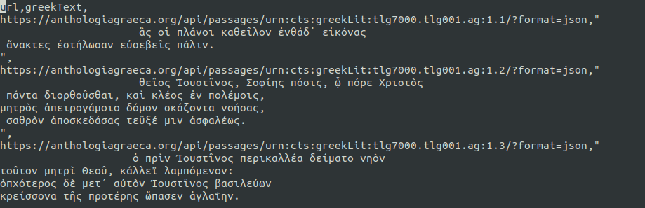

Compte-rendu du TP02 : description du corpus de données.

## Présentation du corpus

### Références

> Vitali-Rosati, Marcello, Elsa Bouchard, Christian Raschle. "Pour une édition numérique collaborative de l'Anthologie grecque." Chaire de recherche du Canada sur les écritures numériques, accédé le 9 novembre 2022, <url = https://anthologiagraeca.org/>.

Pour une liste complète des collaborateurs (coordination, développement, éditeurs, partenaires, etc.), consulter le site web [https://anthologiagraeca.org/pages/equipe-et-partenaires/](https://anthologiagraeca.org/pages/equipe-et-partenaires/). 

Une grande partie des textes en grec ancien et des traductions en anglais sont tirés de : 

> Paton, W. R. *The Greek Anthology*. Harvard University Press; W. Heinemann, New York, 1916-18. (Cinq volumes)

### Le manuscrit

L'Anthologie grecque est un recueil qui regroupe la poésie épigrammatique grecque issue de la période classique jusqu'à la période byzantine, soit près de 4000 pièces, de 325 auteurs différents, s'étalant sur plus de 15 siècles.
Telle que nous la possédons aujourd'hui, l'Anthologie a une histoire complexe [@cameron_greek_1993].
L'expression « Anthologie grecque » désigne l'ensemble constitué par deux parties. 
D'une part, l'Anthologie palatine, un manuscrit datant du X<sup>e</sup> siècle (le *Codex Palatinus 23*) retrouvé en 1606 par Claude Saumaise à la Bibliothèque palatine d'Heidelberg. 
D'autre part, l'*Appendix Planudea*, soit les épigrammes absentes du manuscrit palatin, présentes dans l'Anthologie de Planude, une compilation datant du début du XIV<sup>e</sup> siècle, rédigée par Maxime Planude [@aubreton_tradition_1968; @beta_moi_2019].

Monument de la littérature, l'Anthologie est le document principal qui nous transmet la poésie épigrammatique antique [@gutzwiller_poetics_1997; @gutzwiller_poetic_1998]. 
Né en Grèce, le genre de l'épigramme évolue de manière significative dans l'histoire de la littérature grecque, mais également au sein même de l'Anthologie. 
Initialement composée pour être gravée (*epigramma* signifie « texte inscrit sur un objet »), l'épigramme se présente comme un petit poème, simple, composé d'une ou de deux lignes. 
Les premières épigrammes étaient des épitaphes ou des inscriptions accompagnant une statue, un don ou un ex-voto. 
Vers le VI<sup>e</sup> siècle, ces inscriptions se versifient. 
Dès l'époque hellénistique, l'épigramme se détache de son support, se diversifie dans son propos et devient un véritable genre littéraire, caractérisée par sa brièveté (*brevitas*) et son trait piquant (*argutia*), et se grave désormais non pas dans le marbre, mais dans l'esprit du lectorat.

L'Anthologie grecque offre plusieurs thèmes, sujets et registres de langues ; par exemple, le premier livre rassemble les épigrammes chrétiennes et le cinquième des épigrammes amoureuses ou érotiques. 
Les derniers livres sont moins nettement divisés par thèmes, une conséquence de leur addition tardive au projet. 
Ainsi, le langage n'est pas consistant, allant de l'oraison funéraire à la blague mathématique en passant par les descriptions littéraires et la théologie chrétienne. 

En plus de présenter un intérêt certain pour l'étude du genre épigrammatique [@prioux_petits_2008], l'Anthologie grecque constitue un corpus précieux et diversifié de formes intertextuelles, dont celle de la variation. 
Plusieurs des auteurs de l'Anthologie s'inspirent en effet les uns des autres [@waltz_anthologie_1960]. 
La *variatio*, forme très spécifique d'intertextualité commune et prisée dans la littérature grecque, consiste à reprendre une pièce d'un autre auteur et de la réécrire avec des variations stylistiques, rhétoriques ou paradigmatiques [@laurens_abeille_1989]. 
Le procédé était particulièrement apprécié des épigrammatistes : la simplicité de la forme permettait aux auteurs de s'illustrer en l'espace de quelques vers. 
Ainsi, l'épigramme est souvent décrite comme un art de la variation en tant que tel [@taran_art_1979]. 
La nature même du corpus anthologique (la réunion de poèmes hétéroclites néanmoins reliés par des topoï communs) en fait une source d'intertextualité inépuisable. 
Certains thèmes reviennent particulièrement fréquemment, et les épigrammes se répondent, parfois avec plusieurs siècles de décalage [@gutzwiller_poetic_1998]. 
Cette forme (qui s'apparente presque à du plagiat), bien vue et encouragée par les pratiques rhétoriques, commande la production de la littérature grecque et son évolution [@laurens_abeille_1989].

### Description de l'API

La Chaire de recherche du Canada sur les écritures numériques porte depuis 2014 un projet de recherche initialement intitulé "Édition numérique collaborative de l'Anthologie Palatine et de ses multiples vérités", puis "Pour une édition numérique collaborative de l'Anthologie grecque" suite à l'intégration du manuscrit de Planude dans le projet.
Il existe plusieurs différences entre le manuscrit décrit dans la section précédente et l'API utilisée dans le présent projet de fouille de texte. 
"Pour une édition numérique collaborative de l'Anthologie grecque" offre une collection de 4134 épigrammes en grec ancien rédigées par 310 auteurs plutôt que 325. 
Ce sont en fait 309 auteurs qui sont nommés dans l'API, le 310ème regroupant les auteurs anonymes. 
Le projet rend disponible le manuscrit et l'Anthologie sous plusieurs formes, des images des manuscrits originaux, les textes en langue originale, des traductions et des informations telles que l'auteur, des listes de mots clés, des commentaires philologiques, etc. 
Ces données sont disponibles sur le site web du projet et sous forme d'API (*Application Programming Interface*) à [https://anthologiagraeca.org/api/](https://anthologiagraeca.org/api/).
Chacune des épigrammes devient un fragment accessible au moyen d'une requête `GET`. Ce dispositif est documenté sur un [site web](http://api-doc.anthologiagraeca.org/) dédié.

L'ensemble de ce manuscrit est disponible en accès libre. Nous remercions les partenaires du projet : 

- La Chaire de recherche du Canada sur les écritures numériques, porteuse du projet de recherche et de l'API ;
- La Bibliothèque numérique Perseus, grâce à laquelle les textes en grec et en anglais ont pu être récupérés ;
- La Bibliothèque Palatine (Heidelberg), qui rend disponible les épigrammes sous forme de fragment (image) au format IIIF.

### Récupération des données

Les données sont disponibles via l'API à l’URL suivante : [http://anthologiagraeca.org/api/passages](http://anthologiagraeca.org/api/passages).
Pour ne pas travailler uniquement depuis l'API^[Les requêtes à partir du module python requests demandent un certain temps, ce qui ralenti les calculs, et le corpus est assez léger pour travailler en local.], nous avons décidé d'exporter l'ensemble des épigrammes du corpus dans un fichier que nous garderons en local. 
Pour ce faire, nous avons réalisé un script en `python` décrit ci-dessous.
L'ensemble des données de l'API sont accessibles via l'*endpoint*, pour les récupérer, nous les injectons sous forme de liste dans une variable `results`.
L’API sert les données paginées, de fait les données récupérées sont limitées à la première page, or, nous voulons récupérer l’ensemble du corpus.
Pour parer cette fonctionnalité, nous créons une boucle `while` pour modifier l’URL de la page (vers la page suivante) et indexer toutes les données de chacune des pages de l'API dans notre variable.

```python
# Importation des librairies python nécessaires
# Définition des variables pour les requêtes

import requests
import json
import csv

url = 'http://anthologiagraeca.org/api/passages'
parameters = {
    'format':'json',
    'limit':'500'
}
results = []
pagination= True
while pagination == True :
    data = requests.get(url, parameters).json()
    for result in data['results'] :
        results.append(result)
    if data['next'] is None:
        pagination = False
    else:
        url = data['next']

```

La première vérification consiste à comparer le nombre de résultats obtenus avec le nombre total d’épigrammes indexées dans le portail de l’Anthologie grecque.

```python
len(results)
```
```python
    4134
```

Maintenant que nous avons bien récupéré nos données, nous souhaitons créer un fichier au format `JSON` que nous pourrons utiliser pour les futures étapes de notre fouille de texte.

Nouvel export : nous avions prévu de travailler uniquement avec le format `JSON`, mais la plupart des logiciels de fouille de textes prennent en charge le format `CSV` en entrée ! Ainsi, nous avons retravaillé l’export de l’API pour avoir du `JSON` et du `CSV`.

```python
# Export au format json
mesTextes = []
for epigram in results:
    mesTextes.append({'url': epigram['url'], 'greekText': [text for text in epigram['texts'] if text['language'] == 'grc']})

# Export au format csv
mesChamps = ['url', 'greekText']
mesEpigrammes = []
for epigram in results:
    for text in epigram['texts']:
        if text['language'] == 'grc':
            mesEpigrammes.append([epigram['url'], text['text']])
```
```python
# Export au format json
out_file = open('greek-epigram.json', 'w')

json.dump(mesTextes, out_file, indent=3, ensure_ascii=False)

# Export au format csv
with open('EpigramsGreek.csv', 'w') as f:
      
    # Utilisation de la méthode csv.writer de la librairie CSV
    write = csv.writer(f)
      
    write.writerow(mesChamps)
    write.writerows(mesEpigrammes)
```
Le résultat obtenu avec ce script comporte un document `JSON` et un document `CSV` contenant les épigrammes grecques et les URL (via l'API) qui permettent de les identifier.

### Informations précises sur le corpus

L'Anthologie grecque telle que présente dans l'API comporte 4134 épigrammes réparties entre 16 livres, présentés dans le présent graphique.


Cette visualisation ne représente pas la longueur de ces épigrammes, le livre 2 par exemple est divisé entre seulement 10 épigrammes, ces derniers sont toutefois longs de 257.5 mots^[Pour effectuer ces calculs, nous utilisons une segmentation simple à l'aide des espaces dans les `string` des textes en grec ancien.].

|Livre|Épigrammes|Longueur moyenne en mots|
| -- | -- | -- |
| 1 | 123 | 55.41 | 
| 2 | 10 | 257.50 | 
| 3 | 19 | 37.53 | 
| 4 | 5 | 166.40 | 
| 5 | 310 | 64.67 | 
| 6 | 359 | 49.36 | 
| 7 | 758 | 59.11 | 
| 8 | 258 | 31.67 | 
| 9 | 831 | 46.79 | 
| 10 | 127 | 38.11 | 
| 11 | 443 | 44.29 | 
| 12 | 260 | 45.95 | 
| 13 | 32 | 41.47 | 
| 14 | 151 | 45.03 | 
| 15 | 52 | 93.87 | 
| 16 | 396 | 41.13 | 

À titre de comparaison, la longueur moyenne des épigrammes est 30.69 mots. 
L'Anthologie grecque suit une distribution intéressante quant à la longueur des épigrammes, trois groupes principaux étant visibles : soit les épigrammes de moins de 17 mots, ceux de plus de 30, et finalement ceux entre ces deux groupes. 


L'API est un projet incomplet auquel des modifications sont encore apportées presque toutes les semaines, en ce sens, il est important de noter que cinq des épigrammes n'ont pas de textes en grec qui leur sont associés dans le `JSON`. 
Les épigrammes 7.0 et 11.0 n'ont simplement pas de texte en grec qui leur sont associés, bien que des images de fragments existent pour chacun. 
Similairement, le texte 16.10 contient uniquement les caractères "῀.".
Finalement, deux épigrammes du livre 11 ont vu leurs textes en grec être encodé "eng" plutôt que "grc" de sorte qu'une recherche automatique ne découvre pas de texte en grec ancien pour les fragments 376 et 382 de ce livre. 
Dans le cadre de notre fouille de texte en python, ces erreurs étaient assez peu nombreuses pour que nous puissions les corriger à la main. 

### Prétraitement avec [Orange Data Mining](https://orangedatamining.com/)

Le corpus au format `CSV` est brut, nous y trouvons seulement les épigrammes grecques et leur URL pour les identifier, mais nous aurons certainement besoin de le compléter avec d'autres informations et/ou de le réduire pour correspondre au mieux à notre problématique sur les variations.




Afin de comprendre comment nous allons pouvoir travailler avec cet objet, nous avons décidé d'effectuer des premiers tests de *preprocessing* avec le logiciel _Orange Data Mining_. Orange est un outil de programmation visuelle, l'utilisation de `widgets` dans l'espace de travail du logiciel permet de créer un `workflow` et d'appliquer une suite d'opérations aux données du corpus. Nous avons suivi l'un des workflows proposé en exemple dans la documentation du logiciel afin d'observer la forme des résultats que nous pouvons obtenir. 
Les widgets utilisés sont les suivants : 

- `Preprocess Text` : ce widget permet de transformer (lowercase), de tokeniser (expression régulière `\w+`), de normaliser (lemmatiser selon les lemmes grecs) et de filtrer (liste de *stopwords* créée par l'équipe de la CRCEN, et suppression des tokens en dehors d'une certaine fréquence) le corpus d'épigrammes. Avec 4218 `instances` en entrée, nous obtenons 64637 `tokens` et 36279 `types`. Ce résultat n'a jamais été deux fois le même selon les paramètres utilisés.


- Orange permet d'ores et déjà une première visualisation du corpus sous forme de nuage de mots grâce au widget `Word Cloud`. 


- Le widget suivant s'appelle `Bag of Words`, il crée un compteur de la fréquence de chaque terme du corpus.
- `Distances` calcule la distance (cosinus dans notre cas) entre chaque ligne du fichier source : il détermine la proximité entre les lignes.
- `Hierarchical Clustering` offre une visualisation sous forme de cluster des distances calculées précédemment. 


- L'avant dernier widget, `Corpus Viewer` permet une visualisation plus fine des clusters : en sélectionnant un cluster particulier ou un ensemble de clusters, il est possible de les afficher sous forme de données brutes dans une nouvelle fenêtre.


- Le dernier widget `MDS`, mal placé dans cet exemple, est une autre technique de regroupement. Nous développerons ultérieurement cette approche.


Les résultats que nous obtenons permettent de faire un premier état des lieux sur notre corpus : il nous faut correctement composer ce dernier pour commencer à réellement travailler à la problématique sur les variations. Toutefois, les regroupements par clusters (à partir des distances par cosinus) ne sont pas sans intérêt, en effet, nous remarquons que les clusters regroupent des mot-clefs appartenant à un même champ lexical. Si nous reprenons l'exemple affiché précédemment, les épigrammes du cluster sont articulées autour des mots clefs "Muse", "peinture", "écriture". 
Cette méthode d'apprentissage automatique fait partie de l'ensemble des méthodes non supervisées (conseillée à la fin du TP01) et fera l'objet d'une attention particulière pour les prochains développements de cette étude.

## Bibliographie